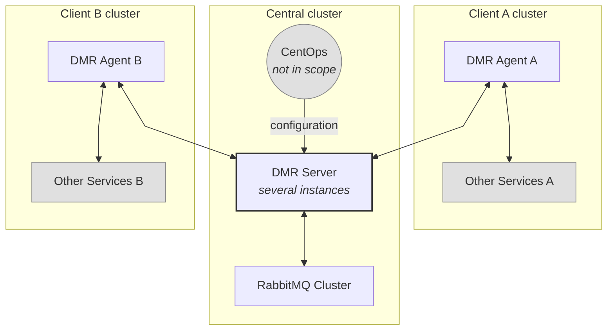

# DMR (Distributed Message Rooms)

## Business case

Currently, there is no way to pass questions from one Bürokratt instance to another. This means that if an end-user asks a question that the local Bürokratt instance cannot answer, he will receive no meaningful reply — even if some other Bürokratt instance could answer it.

An example: a user comes to the Tax Authority web, and asks a question about crime, the Tax Authority instance will not be able to answer it. The Police instance **is able** to answer the question but there is no way to forward it.

So the goal is to built a system that can efficiently and securely forward questions and answers between Bürokratt instances.

## Architecture chart



## Key components

### DMR agents

- DMR agents run in every client's Bürokratt cluster. They are responsible for forwarding messages to the DMR Server and receiving messages from it in real-time. This is done via a WebSocket connection.
- DMR agents encrypt and decrypt messages using public-key cryptography. Private keys are delivered to the agents at infrastructure level. Other DMR agents' public keys are distributed by DMR server on establishing a WebSocket connection.
- Metadata needed to pass the messages along — like sender and recipient IDs — is not encrypted.
- The DMR agents also expose an API for communicating with other services in the client's Bürokratt cluster.

### DMR server

- Key functionality is to forward the messages between DMR agents using RabbitMQ.
- Uses WebSockets to exchange messages with DMR agents.
- Gets its configuration from CentOps. CentOps is developed separately and is **out of scope for this project**.
- Can also distribute configuration to DMR agents if necessary, namely a list of other DMR agents and their public keys.
- DMR server _itself_ is lightweight and stateless, it does not store any messages or configuration data in any sort of a DB.
- **Cannot** read the message contents, these are encrypted by the DMR agents.
- There can be several instances of DMR server running, depending on load.
- In the future, can potentially be extended to perform operations — like applying policies — on incoming and outgoing messages.
- Includes support for Prometheus-based monitoring to help track the real-time health and behavior of the DMR server, specifically around WebSocket activity and message processing.
- **Metrics endpoint**: [`http://localhost:${PORT}/metrics`](http://localhost:PORT/metrics) — compatible with Prometheus.

### RabbitMQ

- Has per-Agent message queues.
- Has a dead letter queue for messages that failed to deliver.
- Has RabbitMQ UI-based monitoring tools set up.
- Supports RabbitMQ clustering for scalability.
- <https://www.rabbitmq.com/kubernetes/operator/operator-monitoring>

## Docker and Docker Compose

The DMR system can be easily deployed using Docker and Docker Compose. The repository includes Docker configurations for all components.

### Docker Files

- DMR Server Dockerfile: [`apps/dmr-server/Dockerfile`](apps/dmr-server/Dockerfile)
- DMR Agent Dockerfile: [`apps/dmr-agent/Dockerfile`](apps/dmr-agent/Dockerfile)

### Docker Compose

The main Docker Compose file is located at the root of the repository: [`docker-compose.yml`](docker-compose.yml). Run with the following command from the root directory of the project:

```bash
docker compose up -d
```

### Manual testing

You can test the whole flow of the solution this way:

1. Install [ngrok](https://ngrok.com) and run it with `ngrok http http://localhost:8080`.
2. Copy the URL provided by ngrok and set it as `OUTGOING_MESSAGE_ENDPOINT` for `dmr-agent-a` in `docker-compose.yml`.
3. Run `docker compose up -d`.
4. Run this command to send a message in [the proper format](#sending-messages) through `dmr-agent-b`:

```bash
curl -X POST http://localhost:8074/v1/messages \
    -H "Content-Type: application/json" \
    -d '{
    "id": "b1a7e8c2-1234-4f56-9abc-1234567890ab",
    "recipientId": "d3b07384-d9a0-4c3f-a4e2-123456789abc",
    "timestamp": "2024-01-15T10:30:00.000Z",
    "type": "ChatMessage",
    "payload": {
      "chat": {
        "id": "f47ac10b-58cc-4372-a567-0e02b2c3d479",
        "created": "2024-01-15T10:00:00.000Z"
      },
      "messages": [
        {
          "id": "550e8400-e29b-41d4-a716-446655440000",
          "chatId": "f47ac10b-58cc-4372-a567-0e02b2c3d479",
          "content": "example string 2",
          "authorTimestamp": "2024-01-15T10:30:00.000Z",
          "authorRole": "end-user"
        }
      ]
    }
  }'
```

5. `dmr-agent-b` will forward this message to `dmr-server`. `dmr-server` will add it to the queue for `dmr-agent-a`. `dmr-agent-a` will receive it from `dmr-server` and forward it to the `OUTGOING_MESSAGE_ENDPOINT`. You should see the message in the ngrok tunnel.

## Environment Variables

Below is a list of all environment variables used by the DMR system, organized by service. Sensible variable values are also specified in the docker-compose file.

### DMR Server variables

| Variable                                      | Description                                                                                                                                                          | Required | Default Value         |
| --------------------------------------------- | -------------------------------------------------------------------------------------------------------------------------------------------------------------------- | -------- | --------------------- |
| `PORT`                                        | Port on which the DMR server will run                                                                                                                                |          | `5000`                |
| `ENVIRONMENT`                                 | NodeJS Runtime environment. **Should be set to `production` when deployed to ANY environment, including test environments.**                                         |          | `development`         |
| `LOGGER_COLORS`                               | Enable colored logs. **Strongly suggest to disable when deployed.**                                                                                                  |          | `true`                |
| `LOGGER_LOG_LEVELS`                           | Comma-separated log levels to output                                                                                                                                 |          | `error,warn,log`      |
| `WEB_SOCKET_MAX_DISCONNECTION_DURATION`       | Maximum duration (ms) for DMR Agent WebSocket disconnection. Used by [connection state recovery](https://socket.io/docs/v4/server-options/#connectionstaterecovery). |          | `120000` (2 minutes)  |
| `CENTOPS_CONFIGURATION_URL`                   | URL for CentOps configuration service. **Can be set to any value when using [CentOps configuration endpoint mock](#centops-mock).**                                  | Yes      |                       |
| `CENTOPS_CONFIGURATION_CRON_TIME`             | Cron schedule for fetching configuration (agent list) from CentOps                                                                                                   |          | `*/30 * * * *`        |
| `RABBITMQ_DEFAULT_HOST`                       | Hostname for RabbitMQ connection                                                                                                                                     | Yes      |                       |
| `RABBITMQ_DEFAULT_PORT`                       | Port for RabbitMQ AMQP connection                                                                                                                                    | Yes      |                       |
| `RABBITMQ_DEFAULT_MANAGEMENT_UI_URI`          | URI for RabbitMQ management interface                                                                                                                                | Yes      |                       |
| `RABBITMQ_DEFAULT_USER`                       | Username for RabbitMQ authentication                                                                                                                                 | Yes      |                       |
| `RABBITMQ_DEFAULT_PASS`                       | Password for RabbitMQ authentication                                                                                                                                 | Yes      |                       |
| `RABBITMQ_DEFAULT_TTL`                        | Default message TTL (ms) for normal agent queues                                                                                                                     |          | `300000` (5 minutes)  |
| `RABBITMQ_DEFAULT_DLQ_TTL`                    | TTL (ms) for messages in agent dead letter queues (DLQs)                                                                                                             |          | `86400000` (24 hours) |
| `RABBITMQ_VALIDATION_FAILURES_TTL`            | TTL (ms) for messages in validation failures queue                                                                                                                   |          | `86400000` (24 hours) |
| `RABBITMQ_DEFAULT_DEFAULT_RECONNECT_INTERVAL` | Interval (ms) for reconnection attempts from DMR server to RabbitMQ                                                                                                  |          | `5000` (5 seconds)    |

#### CentOps mock

CentOps configuration endpoint is currently mocked in DMR Server. The following variables are **required in DMR Server** when using this mock. These should be removed when CentOps is no longer mocked.

| Variable                       | Description                                                                                                 | Default Value |
| ------------------------------ | ----------------------------------------------------------------------------------------------------------- | ------------- |
| `MSW_ENABLED`                  | Enables CentOps configuration endpoint mock                                                                 | `true`        |
| `NODE_TLS_REJECT_UNAUTHORIZED` | Disables TLS certificate trust check, required for CentOps mock                                             | `0`           |
| `MOCK_DMR_AGENT_A_PUBLIC_KEY`  | Public key for mock Agent A (development/testing). **Should match the private key in agent env variables.** |               |
| `MOCK_DMR_AGENT_B_PUBLIC_KEY`  | Public key for mock Agent B (development/testing). **Should match the private key in agent env variables.** |               |
| `MOCK_DMR_AGENT_A_ID`          | UUID for mock Agent A (development/testing). **Should match the ID in agent env variables.**                |               |
| `MOCK_DMR_AGENT_B_ID`          | UUID for mock Agent B (development/testing). **Should match the ID in agent env variables.**                |               |

### DMR Agent variables

| Variable                           | Description                                                                                                                   | Required | Default Value    |
| ---------------------------------- | ----------------------------------------------------------------------------------------------------------------------------- | -------- | ---------------- |
| `PORT`                             | Port on which the DMR agent will run                                                                                          |          | `5001`           |
| `ENVIRONMENT`                      | NodeJS Runtime environment. **Should be set to `production` when deployed to ANY environment, including test environments.**  |          | `development`    |
| `LOGGER_COLORS`                    | Enable colored logs. **Strongly suggest to disable when deployed.**                                                           |          | `true`           |
| `LOGGER_LOG_LEVELS`                | Comma-separated log levels to output                                                                                          |          | `error,warn,log` |
| `DMR_SERVER_WEBSOCKET_URL`         | URL for connecting to DMR Server via WebSocket                                                                                | Yes      |                  |
| `WEBSOCKET_RECONNECTION_DELAY`     | Initial delay (ms) for WebSocket reconnection attempts                                                                        |          | `1000`           |
| `WEBSOCKET_RECONNECTION_DELAY_MAX` | Maximum delay (ms) for WebSocket reconnection attempts                                                                        |          | `5000`           |
| `AGENT_ID`                         | Unique identifier (UUID) for the agent                                                                                        | Yes      |                  |
| `AGENT_PRIVATE_KEY`                | RSA private key for message encryption/decryption and DMR Server authentication                                               | Yes      |                  |
| `OUTGOING_MESSAGE_ENDPOINT`        | HTTP endpoint where decrypted messages will be forwarded inside DMR Agent cluster                                             | Yes      |                  |
| `MESSAGE_DELIVERY_TIMEOUT_MS`      | Timeout (ms) for forwarding the message to DMR Server. Incoming message endpoint will return 504 if this timeout is exceeded. |          | `2000`           |

### RabbitMQ variables

| Variable                | Description                          | Required |
| ----------------------- | ------------------------------------ | -------- |
| `RABBITMQ_DEFAULT_USER` | Username for RabbitMQ authentication | Yes      |
| `RABBITMQ_DEFAULT_PASS` | Password for RabbitMQ authentication | Yes      |

## Sending messages

DMR Agent will accept incoming messages on `/v1/messages` POST endpoint. It will forward outgoing messages to the `OUTGOING_MESSAGE_ENDPOINT`. See [DMR Agent variables](#dmr-agent-variables).

Messages endpoint supports versioning. The `v1` version message JSON structure is the following. This structure closely matches the DB schema of [Chatbot module](https://github.com/buerokratt/Buerokratt-Chatbot).

```jsonc
{
  "id": "b1a7e8c2-1234-4f56-9abc-1234567890ab",
  "recipientId": "d3b07384-d9a0-4c3f-a4e2-123456789abc",
  "timestamp": "2024-01-15T10:30:00.000Z",
  "type": "ChatMessage", // For now, only ChatMessage is supported
  "payload": {
    "chat": {
      "id": "f47ac10b-58cc-4372-a567-0e02b2c3d479",
      "created": "2024-01-15T10:00:00.000Z",
      // All fields below are optional:
      "endUserFirstName": "Alice",
      "endUserLastName": "Smith",
      "endUserId": "user-123",
      "endUserEmail": "alice@example.com",
      "endUserPhone": "+123456789",
      "customerSupportDisplayName": "Support Bot",
      "endUserOs": "Windows",
      "endUserUrl": "https://example.com",
    },
    "messages": [
      {
        "id": "550e8400-e29b-41d4-a716-446655440000",
        "chatId": "f47ac10b-58cc-4372-a567-0e02b2c3d479",
        "content": "example string 2",
        "authorTimestamp": "2024-01-15T10:30:00.000Z",
        "authorRole": "end-user",
        // All fields below are optional:
        "event": "joined",
        "csaTitle": "Agent",
        "authorId": "agent-123",
        "authorFirstName": "Bob",
        "authorLastName": "Brown",
        "forwardedByUser": "user-456",
        "forwardedFromCsa": "Support A",
        "forwardedToCsa": "Support B",
        "originalBaseId": "base-789",
        "originalCreated": "2024-01-15T09:00:00.000Z",
        "rating": "5",
        "created": "2024-01-15T10:30:00.000Z",
        "preview": "Preview text",
        "updated": "2024-01-15T10:31:00.000Z",
        "buttons": "[]",
        "options": "{}",
      },
    ],
  },
}
```

## RabbitMQ

### Queues

The RabbitMQ setup includes several types of queues to handle message routing and failure scenarios. All queues are **durable** and survive broker restarts. All messages are **persistent** so they are written to disk and survive broker restarts.

#### Normal Queues

- Each DMR agent has its own dedicated message queue for receiving messages.
- New agent queues are created when DMR server receives new agents in configuration from CentOps.
- Queue naming convention: `{agent-id}`. The agent ID (UUID) serves as the queue name.
- All queues are configured as quorum queues to support RabbitMQ clustering.
- Messages have configurable TTL (`RABBITMQ_DEFAULT_TTL`) with automatic expiration. Default is 5 minutes.

#### Dead Letter Queues (DLQs)

- Each agent queue has a corresponding dead letter queue: `{agent-id}.dlq`.
- DLQs are automatically created when setting up agent queues.
- Messages are moved to a DLQ if:
  - Sending messages fails due to some network error or similar — and retries are not successful.
  - Message TTL expires in the original queue.
- DLQs have their own TTL configuration (`RABBITMQ_DEFAULT_DLQ_TTL`) for automatic cleanup. Default is 24 hours.

#### Validation Failures Queue

- This is a **single** queue for all validation failures, it is not per-agent. The name is `validation-failures`.
- It is created on DMR Server start if it does not yet exist.
- Messages are moved to this queue if:
  - Message validation fails when DMR server receives an incoming message, e.g. if the message has no valid `recipientId`.
  - Recipient DMR agent is not able to decrypt the message.
- This queue has its own TTL configuration (`RABBITMQ_VALIDATION_FAILURES_TTL`) for automatic cleanup. Default is 24 hours.

### Kubernetes

Can be set up using [RabbitMQ Cluster Kubernetes Operator](https://www.rabbitmq.com/kubernetes/operator/using-operator). It supports declaratively deploy and manage RabbitMQ clusters on Kubernetes. Simplifies setup, scaling, and enables native support for Prometheus metrics via ServiceMonitor resources.

## Prometheus

### DMR server

List of metrics:

- **`dmr_socket_connections_active`** | `gauge`
  Current number of active Socket.IO connections

- **`dmr_socket_connections_total`** | `counter`
  Total number of established connections

- **`dmr_socket_disconnections_total`** | `counter`
  Total number of disconnections

- **`dmr_socket_connection_duration_seconds`** | `histogram`
  Duration of a socket connection session

- **`dmr_socket_errors_total`** | `counter`
  Total number of connection errors

- **`dmr_socket_events_received_total`** | `counter`
  Total events received from clients
  _(labels: `event`, `namespace`)_

- **`dmr_socket_events_sent_total`** | `counter`
  Total events sent to clients
  _(labels: `event`, `namespace`)_

- **`dmr_message_processing_duration_seconds`** | `histogram`
  Time to process/forward a single message

Suggested alert rules:

```yaml
groups:
  - name: dmr-server-alerts
    rules:
      # Too many disconnected clients suddenly (spike detection)

      - alert: DMRHighDisconnectionRate
        expr: increase(dmr_socket_disconnections_total[5m]) > 100
        for: 2m
        labels:
        severity: warning
        annotations:
        summary: 'High rate of disconnections in DMR Server'

      # Low number of active connections (possible outage)

      - alert: DMRServerSocketsDown
        expr: dmr_socket_connections_active< 1
        for: 1m
        labels:
        severity: critical
        annotations:
        summary: 'No active socket connections detected on DMR Server'

      # Slow message routing

      - alert: DMRServerMessageRoutingLatencyHigh
        expr: histogram_quantile(0.95, rate(dmr_message_processing_duration_seconds[5m])) > 0.5
        for: 2m
        labels:
        severity: warning
        annotations:
        summary: '95th percentile message routing time exceeds 500ms'
```

### DMR agent

List of metrics:

- **`dmr_http_requests_total`** | `counter` | `method, route, status`
  Total HTTP requests handled
- **`dmr_http_request_duration_seconds`** | `histogram` | `method, route, status`
  HTTP request processing time

- **`dmr_http_errors_total` | `counter`** | `method, route`
  Count of error responses (4xx/5xx)

- **`dmr_agent_socket_connection_active`** | `gauge`
  Current number of active Socket.IO connections

- **`dmr_socket_connection_duration_seconds`** | `histogram`
  Duration of a socket connection session

- **`dmr_socket_errors_total`** | `counter`
  Total number of connection errors

- **`dmr_socket_events_received_total`** | `counter`
  Total events received from clients
  _(labels: `event`, `namespace`)_

- **`dmr_socket_events_sent_total`** | `counter`
  Total events sent to clients
  _(labels: `event`, `namespace`)_

- **`dmr_message_processing_duration_seconds`** | `histogram`
  Time to process/forward a single message

Suggested alert rules:

```yaml
groups:
  - name: dmr-agent-alerts
    rules:
      - alert: MultipleSocketConnections
        expr: dmr_agent_socket_connection_active > 1
        for: 1m
        labels:
          severity: warning
        annotations:
          summary: 'Multiple WebSocket connections detected'
          description: >
            DMR Agent is expected to maintain only 1 WebSocket connection. Found {{ $value }}.

      - alert: SocketDisconnected
        expr: dmr_agent_socket_connection_active == 0
        for: 2m
        labels:
          severity: critical
        annotations:
          summary: 'DMR Agent is disconnected from the DMR server'
          description: >
            No active WebSocket connection from DMR Agent for over 2 minutes.

      - alert: HighApiLatency
        expr: |
          histogram_quantile(0.95, rate(dmr_http_request_duration_seconds_bucket[5m]))
          > 1
        for: 2m
        labels:
          severity: warning
        annotations:
          summary: 'High HTTP latency'
          description: >
            95th percentile latency of DMR Agent REST API is over 1s (current: {{ $value }}s)

      - alert: TooManyHttpErrors
        expr: |
          rate(dmr_http_errors_total[5m]) > 1
        for: 5m
        labels:
          severity: warning
        annotations:
          summary: 'High rate of HTTP errors'
          description: >
            More than 1 HTTP error/sec from DMR Agent (4xx or 5xx responses)
```

### RabbitMQ

- <https://www.rabbitmq.com/kubernetes/operator/operator-monitoring>
- <https://www.rabbitmq.com/docs/prometheus>

Suggested metrics:

- **`rabbitmq_queue_messages_ready`** | `gauge`
  number of messages ready for delivery

- **`rabbitmq_queue_messages_unacknowledged`** | `gauge`
  number of messages delivered to consumers but not yet acknowledged

- **`rabbitmq_queue_messages_total`** | `counter`
  total number of messages published to the queue (ready + unacknowledged)

- **`rabbitmq_connections`** | `gauge`
  current number of open connections

- **`rabbitmq_channels`** | `gauge`
  current number of open AMQP channels

- **`rabbitmq_queue_memory_usage`** | `gauge`
  memory used by individual queues

- **`rabbitmq_node_memory_used_bytes`** | `gauge`
  total memory used by the RabbitMQ node

- **`rabbitmq_node_disk_free`** | `gauge`
  disk space remaining on the node

- **`rabbitmq_node_running`** | `gauge`
  node running status (1 = up, 0 = down)

- **`rabbitmq_erlang_processes`** | `gauge`
  number of Erlang processes currently in use

- **`rabbitmq_vm_memory_limit`** | `gauge`
  memory limit of the Erlang VM

- **`rabbitmq_message_stats_publish`** | `counter`
  total number of messages published

- **`rabbitmq_message_stats_ack`** | `counter`
  total number of messages acknowledged

- **`rabbitmq_message_stats_delivery_get`** | `counter`
  total number of messages delivered or fetched from queues

Suggested alert rules:

```yaml
  - alert: RabbitMQHighReadyMessages
  expr: increase(rabbitmq_queue_messages_ready[5m]) > 100000
  for: 5m
  labels:
    severity: warning
  annotations:
    summary: "High number of ready messages in RabbitMQ queue"
    description: "Over 100k messages have accumulated in ready state in the last 5 minutes. Check consumers."

- alert: RabbitMQUnauthorizedAcks
  expr: rabbitmq_queue_messages_unacknowledged > 50000
  for: 5m
  labels:
    severity: critical
  annotations:
    summary: "High unacknowledged messages"
    description: "More than 50k messages are unacknowledged. Consumers might be slow or stuck."

- alert: RabbitMQNodeDown
  expr: rabbitmq_node_running == 0
  for: 1m
  labels:
    severity: critical
  annotations:
    summary: "RabbitMQ node is down"
    description: "A RabbitMQ node has stopped running. Immediate attention required."

- alert: RabbitMQMemoryHigh
  expr: rabbitmq_node_memory_used_bytes / rabbitmq_vm_memory_limit > 0.85
  for: 10m
  labels:
    severity: warning
  annotations:
    summary: "RabbitMQ node memory usage high"
    description: "Memory usage above 85% for more than 10 minutes. Risk of memory alarms."

- alert: RabbitMQDiskLow
  expr: rabbitmq_node_disk_free < 10 * 1024 * 1024 * 1024
  for: 5m
  labels:
    severity: warning
  annotations:
    summary: "RabbitMQ node low disk space"
    description: "Less than 10 GB disk free. Could lead to message persistence issues."
```

## Local development

For development purposes, there is also a simplified docker-compose file in the dmr-server directory: [`apps/dmr-server/docker-compose.yml`](apps/dmr-server/docker-compose.yml) which only sets up RabbitMQ for local development.

### Development

- `start:server`: Start the DMR server in development mode
- `start:agent`: Start the DMR agent in development mode

### Building

- `build`: Build all applications
- `build:server`: Build only the DMR server
- `build:agent`: Build only the DMR agent

### Testing

- `test`: Run tests for all applications
- `test:server`: Run tests for DMR server
- `test:agent`: Run tests for DMR agent
- `e2e`: Run end-to-end tests for all applications
- `e2e:server`: Run end-to-end tests for DMR server
- `e2e:agent`: Run end-to-end tests for DMR agent

For detailed test output, you can add the `--reporter=verbose` flag to any test command:

```bash
pnpm test:server -- --reporter=verbose
pnpm e2e:server -- --reporter=verbose
```

### Code Quality

- `lint`: Run ESLint on all files
- `lint:check`: Check for ESLint errors with zero warnings allowed
- `lint:fix`: Fix auto-fixable ESLint issues
- `format`: Format code using Prettier
- `format:check`: Check code formatting

### Utility

- `clean`: Clean build artifacts and cache
