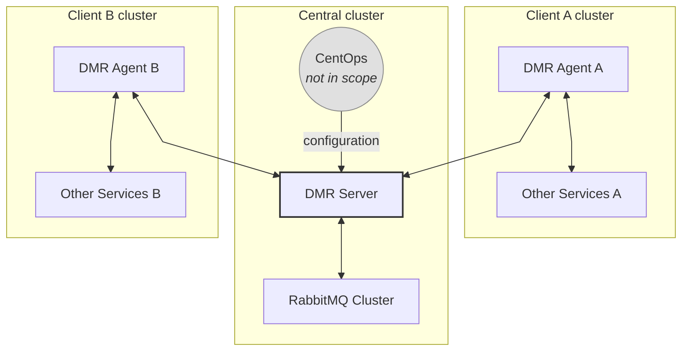

# DMR (Distributed Message Rooms)

## Business case

Currently, there is no way to pass questions from one Bürokratt instance to another. This means that if an end-user asks a question that the local Bürokratt instance cannot answer, he will receive no meaningful reply — even if some other Bürokratt instance could answer it.

An example: a user comes to the Tax Authority web, and asks a question about crime, the Tax Authority instance will not be able to answer it. The Police instance **is able** to answer the question but there is no way to forward it.

So the goal is to built a system that can efficiently and securely forward questions and answers between Bürokratt instances.

## Architecture chart



## Key components

### DMR agents

- DMR agents run in every client's Bürokratt cluster. They are responsible for forwarding messages to the DMR Server and receiving messages from it in real-time. This is done via a WebSocket connection.
- DMR agents encrypt and decrypt messages using public-key cryptography. Private keys are delivered to the agents at infrastructure level. Other DMR agents' public keys are distributed by DMR server on establishing a WebSocket connection.
- Metadata needed to pass the messages along — like sender and recipient IDs — is not encrypted.
- The DMR agents also expose an API for communicating with other services in the client's Bürokratt cluster.

### DMR server

- Key functionality is to forward the messages between DMR agents using RabbitMQ.
- Uses WebSockets to exchange messages with DMR agents.
- Gets its configuration from CentOps. CentOps is developed separately and is **out of scope for this project**.
- Can also distribute configuration to DMR agents if necessary, namely a list of other DMR agents and their public keys.
- DMR server _itself_ is lightweight and stateless, it does not store any messages or configuration data in any sort of a DB.
- **Cannot** read the message contents, these are encrypted by the DMR agents.
- There can be several instances of DMR server running, depending on load.
- In the future, can potentially be extended to perform operations — like applying policies — on incoming and outgoing messages.
- Includes support for Prometheus-based monitoring to help track the real-time health and behavior of the DMR server, specifically around WebSocket activity and message processing.

### RabbitMQ

- Has per-Agent message queues.
- Has a dead letter queue for messages that failed to deliver.
- Has RabbitMQ UI-based monitoring tools set up.
- Supports RabbitMQ clustering for scalability.
- https://www.rabbitmq.com/kubernetes/operator/operator-monitoring

## Prometheus

### DMR server

List of metrics:

- **`dmr_socket_connections_active`** | `gauge`
  Current number of active Socket.IO connections

- **`dmr_socket_connections_total`** | `counter`
  Total number of established connections

- **`dmr_socket_disconnections_total`** | `counter`
  Total number of disconnections

- **`dmr_socket_connection_duration_seconds`** | `histogram`
  Duration of a socket connection session

- **`dmr_socket_errors_total`** | `counter`
  Total number of connection errors

- **`dmr_socket_events_received_total`** | `counter`
  Total events received from clients
  _(labels: `event`, `namespace`)_

- **`dmr_socket_events_sent_total`** | `counter`
  Total events sent to clients
  _(labels: `event`, `namespace`)_

- **`dmr_message_processing_duration_seconds`** | `histogram`
  Time to process/forward a single message

Suggested alert rules:

```yaml
groups:
  - name: dmr-server
    rules:
      # Too many disconnected clients suddenly (spike detection)

      - alert: DMRHighDisconnectionRate
        expr: increase(dmr_socket_disconnections_total[5m]) > 100
        for: 2m
        labels:
        severity: warning
        annotations:
        summary: 'High rate of disconnections in DMR Server'

      # Low number of active connections (possible outage)

      - alert: DMRServerSocketsDown
        expr: dmr_socket_connections_active< 1
        for: 1m
        labels:
        severity: critical
        annotations:
        summary: 'No active socket connections detected on DMR Server'

      # Slow message routing

      - alert: DMRServerMessageRoutingLatencyHigh
        expr: histogram_quantile(0.95, rate(dmr_message_processing_duration_seconds[5m])) > 0.5
        for: 2m
        labels:
        severity: warning
        annotations:
        summary: '95th percentile message routing time exceeds 500ms'
```

### DMR agent

---

## Available Scripts

### Development

- `start:server`: Start the DMR server in development mode
- `start:agent`: Start the DMR agent in development mode

### Building

- `build`: Build all applications
- `build:server`: Build only the DMR server
- `build:agent`: Build only the DMR agent

### Testing

- `test`: Run tests for all applications
- `test:server`: Run tests for DMR server
- `test:agent`: Run tests for DMR agent
- `e2e`: Run end-to-end tests for all applications
- `e2e:server`: Run end-to-end tests for DMR server
- `e2e:agent`: Run end-to-end tests for DMR agent

For detailed test output, you can add the `--reporter=verbose` flag to any test command:

```bash
pnpm test:server -- --reporter=verbose
pnpm e2e:server -- --reporter=verbose
```

### Code Quality

- `lint`: Run ESLint on all files
- `lint:check`: Check for ESLint errors with zero warnings allowed
- `lint:fix`: Fix auto-fixable ESLint issues
- `format`: Format code using Prettier
- `format:check`: Check code formatting

### Utility

- `clean`: Clean build artifacts and cache
